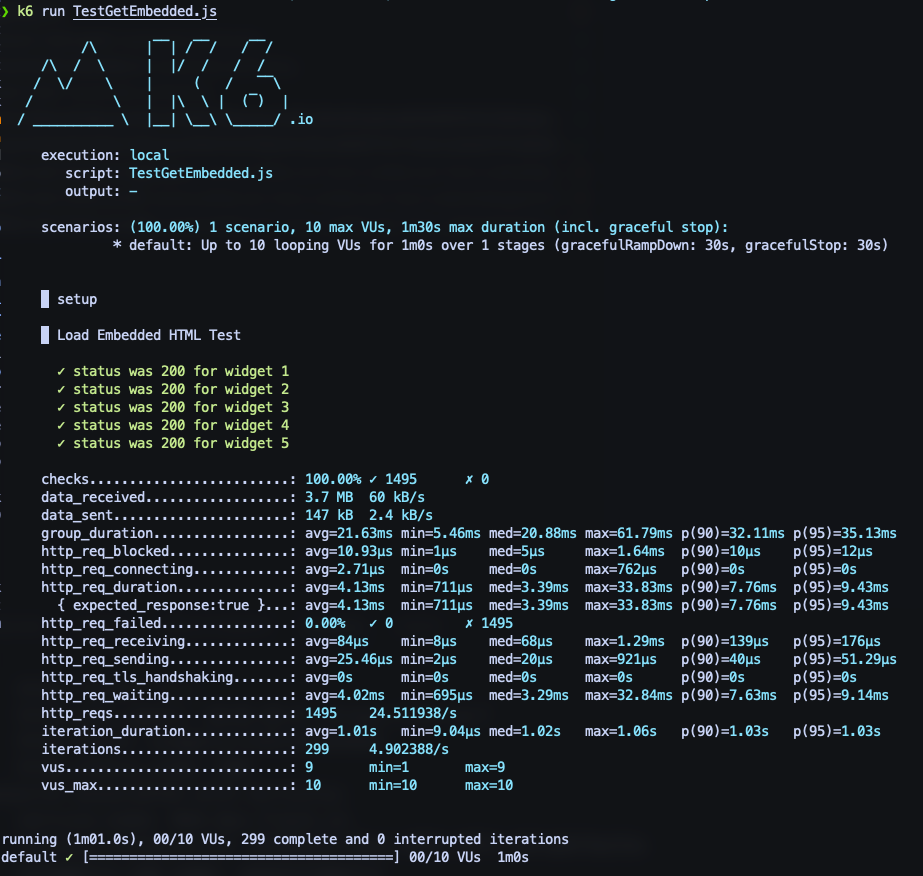

# Relatório de Testes de Carga com k6

## Teste de HTML Embutido dos Widgets

Utilizamos o k6 para realizar testes de carga no endpoint `GET /widgets/{id}/embedded` da nossa aplicação. Este endpoint é crucial pois fornece o HTML embutido para a exibição dos widgets, e uma alta performance é essencial para a experiência do usuário.

### Configuração do Teste

O script `TestLoadEmbeddedHtml.js` foi criado para simular múltiplos usuários acessando simultaneamente o HTML embutido de diferentes widgets. Os IDs de 1 a 5 foram escolhidos arbitrariamente para o teste. O script itera através desses IDs e faz uma requisição GET para cada um, verificando se o status HTTP 200 é retornado, o que indica sucesso.

```javascript
import http from "k6/http";
import { check, sleep, group } from "k6";
import { TestConfig } from "./TestConfigK6.js";

let testConfig = new TestConfig();
export let options = testConfig.options;

export function setup() {
  let widgetIds = [1, 2, 3, 4, 5];
  return { widgetIds };
}

export default function (data) {
  group("Load Embedded HTML Test", function () {
    data.widgetIds.forEach(function (id) {
      let res = http.get(`http://localhost:5244/widgets/${id}/embedded`);
      check(res, {
        [`status was 200 for widget ${id}`]: (r) => r.status === 200,
      });
    });
  });

  sleep(1);
}
```

### Execução e Resultados

O teste foi executado com sucesso, e todos os widgets retornaram o status 200, indicando que o endpoint está respondendo corretamente sob carga. Os tempos de resposta e as métricas de desempenho foram registrados pelo k6, fornecendo insights valiosos sobre a capacidade do sistema.



### Conclusões

O teste de carga para o endpoint de HTML embutido dos widgets mostrou que nossa aplicação pode lidar eficientemente com várias requisições simultâneas. Continuaremos monitorando e otimizando a performance para garantir uma experiência do usuário consistente e responsiva.
